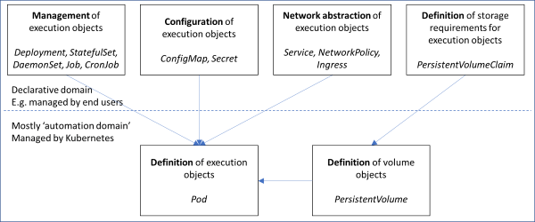
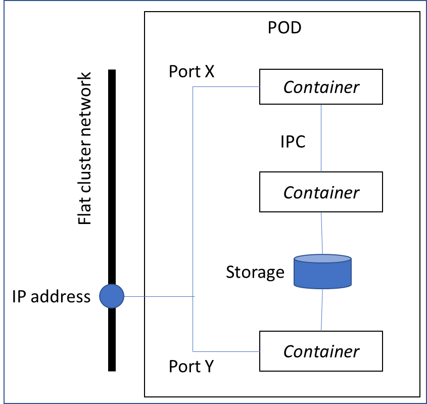
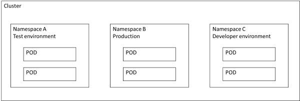

# Kubernetes
## K8s bricks
Kubernetes is configured via various objects, see below:

## The POD model

A POD is the smallest managable execution object in K8.

* Supports scaling, lifecycle, scheduling to worker nodes
* Consists of one or more containers
* Grouping enables strong use-case patterns like init-container, sidecar, ambassador etc.
* Containers can communication
* Only put highly related containers together in a POD
* IP addressable with ports (like VM)
* PODs always see network as a flat network (no NAT)

## Namespaces

Kubernetes supports multiple virtual clusters backed by the same physical cluster.
These virtual clusters are called namespaces

Namespaces do not share anything between them, which is important to know, and thus come in handy when you have multiple users on the same cluster, that you don't want stepping on each other's toes :)

## Exercise 1

1. Check your configuration
2. Setup a namespace
3. Setup a simple pod
