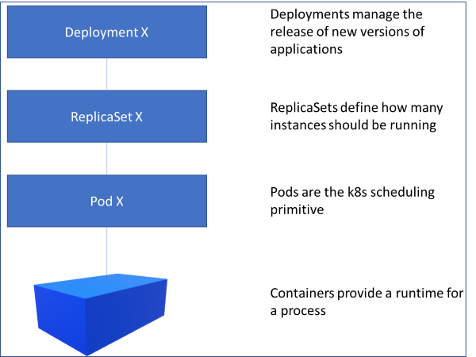

# Interacting with Kubernetes

There are various ways to interact with kubernetes:

* kubectl - the low level command line tool
* Dashboard
* YAML files with resource definitions
* Kustomize - buildin patch and merge tool
* Helm - templating tool for semi-large applications
* Helmfile and Helmsman - helm chart management

## Dashboard

A nice dashboard comes with Minikube, try type (with admin rights):

```bash
minikube dashboard
```

which opens a nice web page showing all the internals of the cluster.


## YAML

The following describes a pod via YAML:

```bash
apiVersion: v1
kind: Pod            # Defines a POD resource - all resources have a kind
metadata:
  name: frontend     # Resource is named 'frontend'
  labels:
    app: frontend    # Resources have labels. Labels connect everything in Kubernetes
spec:
  containers:        # This pod consist of two containers
  - name: webserver
    image: nginx
    ports:
    - containerPort: 80
  - name: myapp
    image: nodeapp
```

The same would be in docker command for a single container:

```shell
$ docker run -d --restart=always --name webserver -p 80:80 nginx
```

and in kubectl:

```shell
$ kubectl create webserver --image=nginx --port=80
```

### Labels

Labels are important in kubernetes, it ties everything together:

* Everything can have labels
* Labels are arbitrary key-values
* Labels are the glue between most resources
* Using multiple labels allows for an N-dimensional grouping of resources

### A deployment

```bash
apiVersion: apps/v1
kind: Deployment     # 
metadata:
  name: frontend     # Resource is named 'frontend'
spec:
  selector:
    matchLabels:
      app: nginx     # The label to match in the service yaml
  replicas: 4        # We want 4 replicas - Kubernetes will deploy and manage these for us
  template:
    metadata:        # Rest is based on the pod template
      labels:
        app: frontend
    spec:
      containers:
      - name: webserver
        image: nginx
        ports:
        - containerPort: 80
      - name: myapp
        image: nodeapp
```

and the service:

```bash
apiVersion: v1
kind: Service
metadata:
  labels:
    app: nginx       # label for this service
  name: nginx        # name of service
spec:
  kind: ClusterIP    # ClusterIP is the default service type. Other types are: NodePort, LoadBalancer, ExternalName
  ports:
  - port: 80
    targetPort: 80
  selector:
    app: nginx       # the deployment to map this service to
```

A few words on service type:
* ClusterIP: Default type. Exposes the service on a cluster-internal ip. Service is only reachable within the cluster.
* NodePort: Exposes the service on each nodes IP at a static port. You can access the service by any node ip and the static port.
* LoadBalancer: Exposes the service externally using a cloud provider’s load balancer.
* ExternalName: Maps the service to the contents of an external name like: foo.bar.com.


To sum up:



With deployments you can:

* Create new deployments
* Update existing deployments
* Rollback deployments
* Scale a deployment
* Pause or resume a deployment

## Exercise 2

* Create a YAML deployment file for the echo server from exercise 1.
* Create a YAML service file for the echo server using NodePort service type.
* Verify access to the server.

To deploy a yaml file, the following command is used:

```bash
$ kubectl create/apply/delete -f my-deployment.yaml  # you can add '--dry-run=true' to let kubectl verify the file
```
