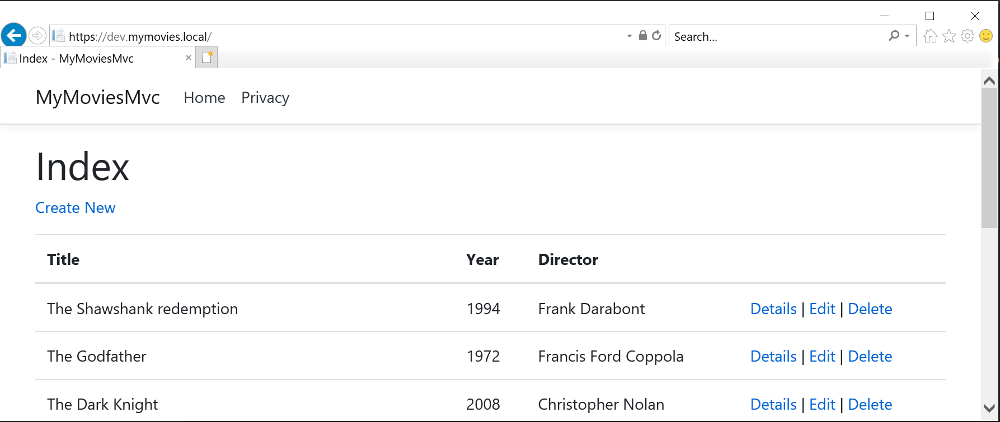

# Exercise 3 - Make MyMovies MVC application run in Kubernetes

## Making minikube and docker share environment

First we need to make sure minikube and docker are working in the same environment, so locally built docker images are available to minikube.

```powershell
minikube docker-env --shell powershell
```

An output like the following is presented:

```powershell
$Env:DOCKER_TLS_VERIFY = "1"
$Env:DOCKER_HOST = "tcp://192.168.99.105:2376"
$Env:DOCKER_CERT_PATH = "C:\Users\sbc\.minikube\certs"
$Env:MINIKUBE_ACTIVE_DOCKERD = "minikube"
# To point your shell to minikube's docker-daemon, run:
# & minikube -p minikube docker-env | Invoke-Expression
```

Copy the last line from your console (excluding the hashtag, but including the ampersand) and execute it from the console you wish to contine this tutorial from:

```powershell
& minikube -p minikube docker-env | Invoke-Expression
```
>This will allow the that powershell prompt (and only that one) to access docker within minikube.

## Register DNS name for kubernetes node

The IP address part of $Env:DOCKER_HOST should be entered in C:\Windows\System32\drivers\etc\hosts for dev.mymovies.local:

```config
# localhost name resolution is handled within DNS itself.
#	127.0.0.1       localhost
#	::1             localhost
192.168.99.105 dev.mymovies.local
# End of section
```

## Create namespace for application

We wil create a namespace for our solution and make it the default namespace for our context. The namespace used in the yaml files is ns-mymovies:

```powershell
kubectl create namespace ns-mymovies

kubectl config set-context $(kubectl config current-context) --namespace=ns-mymovies
```

## Building the application

Let's build and tag the MVC App container:

```powershell
docker build -t mymoviesmvc:v1 -f ./MyMovies/MyMoviesMvc.dockerfile .
```

## Installing certificate

Install our self-signed certificate:

```powershell
kubectl create secret tls tls-certificate --key MyMovies/cert/MyMovies.key --cert MyMovies/cert/MyMovies.crt
kubectl create secret generic tls-rootca --from-file=MyMovies/cert/RootCA.crt
```

## Installing deployments, services and ingress

Install our deployments, our services and our ingress:

```powershell
kubectl create -f MyMovies/kubernetes/db-deployment.yaml
kubectl create -f MyMovies/kubernetes/db-service.yaml
kubectl create -f MyMovies/kubernetes/mvc-deployment.yaml
kubectl create -f MyMovies/kubernetes/mvc-service.yaml
kubectl create -f MyMovies/kubernetes/mvc-ingress.yaml
```

## Verify access to the application

Within a few seconds, the deployments should have launched pods to reflect our wanted scenario, we can inspect this:

```powershell
kubectl get all
```

```powershell
NAME                            READY   STATUS    RESTARTS   AGE
pod/mvc-6d467579b6-hlzcb        1/1     Running   0          63s
pod/mvc-6d467579b6-qlhvg        1/1     Running   0          63s
pod/postgres-68d7cd566c-55tjj   1/1     Running   0          63s

NAME               TYPE        CLUSTER-IP      EXTERNAL-IP   PORT(S)    AGE
service/mvc        ClusterIP   10.105.147.14   <none>        5000/TCP   63s
service/postgres   ClusterIP   10.106.245.23   <none>        5432/TCP   63s

NAME                       READY   UP-TO-DATE   AVAILABLE   AGE
deployment.apps/mvc        2/2     2            2           63s
deployment.apps/postgres   1/1     1            1           63s

NAME                                  DESIRED   CURRENT   READY   AGE
replicaset.apps/mvc-6d467579b6        2         2         2       63s
replicaset.apps/postgres-68d7cd566c   1         1         1       63s
```

It is obvious from the above output that deployment mvc is instructed to have two instances(pods) running at all times.

Lets look closer at the pods.

```powershell
kubectl get pods -o wide
```

We can see that there are two pods with individual internal IP addresses runing the MVC app:

```powershell
NAME                        READY   STATUS    RESTARTS   AGE     IP          NODE             NOMINATED NODE   READINESS GATES
mvc-6d467579b6-hlzcb        1/1     Running   0          2m40s   10.1.0.18   docker-desktop   <none>           <none>
mvc-6d467579b6-qlhvg        1/1     Running   0          2m40s   10.1.0.17   docker-desktop   <none>           <none>
postgres-68d7cd566c-55tjj   1/1     Running   0          2m40s   10.1.0.13   docker-desktop   <none>           <none>
```

If we want to understand how these pods can be available to serve external traffic, lets inspect the ingress:

```powershell
kubectl describe ingress mvc-ingress
```

This reveals that **dev.mymovies.local** is served by one of the two pods on port 5000, and that ssl redirects are enabled and enforced:

```powershell
Name:             mvc-ingress
Namespace:        ns-mymovies
Address:          localhost
Default backend:  default-http-backend:80 (<none>)
TLS:
  tls-certificate terminates dev.mymovies.local
Rules:
  Host            Path  Backends
  ----            ----  --------
  dev.mymovies.local
                  /   mvc:5000 (10.1.0.17:5000,10.1.0.18:5000)
Annotations:
  nginx.ingress.kubernetes.io/ssl-passthrough:     false
  nginx.ingress.kubernetes.io/ssl-redirect:        true
  kubernetes.io/ingress.class:                     nginx
  nginx.ingress.kubernetes.io/force-ssl-redirect:  true
  nginx.ingress.kubernetes.io/rewrite-target:      /
Events:                                            <none>
```

Enough theory, let's see if it is running. Head over to <https://dev.mymovies.local> and you should see something like this:


Feel free to play around and add movies or modify/delete some of the existing.

> _*NOTE*_ the database is hosted within the PostgreSQL container, so data is NOT persisted across container restarts. This is NOT the way to go about a production setup, but for this demo, it will suffice.

